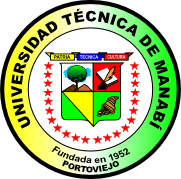

## Bienvenidos a ConTeXt-ec

Bienvenido a ConTeXt-ec; la comunidad de usuarios del programa ConTeXt de Ecuador.

ConTeXt es un sistema de composición de textos diferente a los procesadores de texto más conocidos como LibreOffice Writer y Word. Nuestro objetivo es difundir el uso de software libre y compartir nuestros conocimientos en el uso de ConTeXt para la preparación de documentos de texto. Estamos enfocados principalmente en la comunidad universitaria quienes deben lidiar con la redacción de textos casi a diario. En ConTeXt tendrás un ambiente cómodo y profesional para crear tus documentos de texto que quedarán correctamente estructurados y con un aspecto elegante. 

Te animamos a descubrir las posibilidades ConTeXt, será un tiempo bien invertido!


## [Instalación en Windows](./documentos/install-win.pdf)
## [Instalación en GNU/Linux (videos)](https://b2aeaa58a57a200320db-8b65b95250e902c437b256b5abf3eac7.ssl.cf5.rackcdn.com/media_entries/13173/context_1.webm)

## [Talleres](./talleres/talleres.md)

## [Documentos](./documentos/docs.md)

## [Blog](./posts/blog.md)

## [Lista de correo](./documentos/lista.md)

### Contacto
```
Grupo de usuarios de ConteXt de Ecuador
Lizardo M. Reyna Bowen
Universidad Técnica de Manabí
contextec@disroot.org | lreyna@utm.edu.ec
Portoviejo, Manabí, Ecuador
```


[https://utm.edu.ec/](https://utm.edu.ec/)
